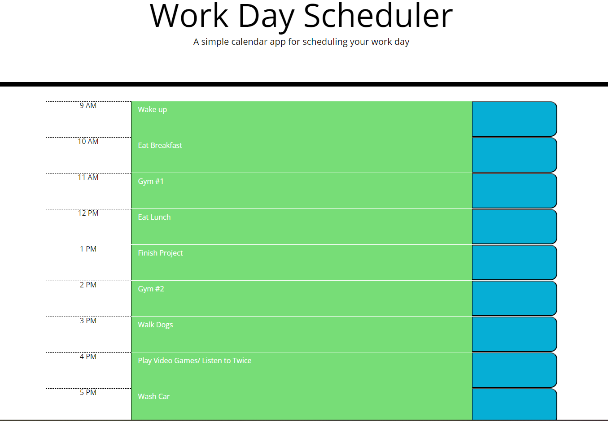

# Work Day Scheduler

## Description
The objective of this project, is to create a simple calender application that allows the user to save events for each hour of the day. The app will run in the browswer and feature dynamically updated HTML and CSS powered by jQuery.

## Usage
The scheduler is from 9 AM - 5 PM, which would be a typical workday. To plan out the day the user will write down their events on the designated timeslots and click the blue button to save. The data will be saved in localStorage() so that when the user refreshes the page, the data will still be saved and displayed. 

On the HTML and JavaScript, there are hourBlocks which can determine if the event will be in the future, present, or past. 

Past = Grey Block
Present = Red Block
Future = Green Block

### Screen Shot of scheduler when empty

### Screen shot of scheduler with data displayed

### Screen recording of inputting, saving, refreshing, deleting, and refreshing again